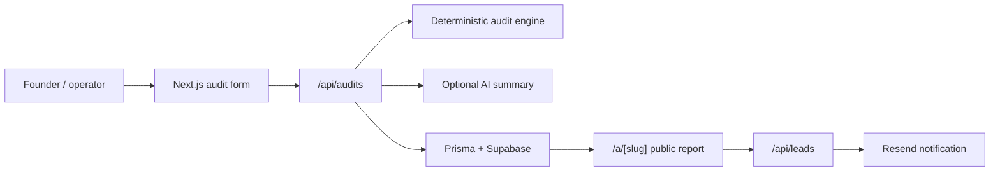

# Architecture

## System Shape

This is intentionally a modular monolith. For a 7-day MVP, separate services would add deployment and debugging risk without improving the evaluation signal.

## Key Decisions

The audit engine is pure TypeScript in `src/lib/audit`. It accepts typed input and returns typed recommendations. This makes financial reasoning testable, reviewable, and independent from AI output.

AI is only used in `src/lib/audit/summary.ts` to rewrite the summary. If OpenAI fails or is not configured, users still receive the deterministic summary.

Persistence uses Prisma because it gives a clear schema, type-safe access, and straightforward Supabase deployment. The development fallback keeps the demo functional even before database setup.

Rate limiting is handled via Upstash Redis (`@upstash/redis` compatible `fetch` calls) to ensure resilience against serverless cold starts. If Redis is unconfigured, it gracefully falls back to process-memory for local development.

## Folder Structure

| Path | Purpose |
| --- | --- |
| `src/app` | Next.js routes and API endpoints |
| `src/components` | UI components and product workflow |
| `src/lib/audit` | Catalog, schemas, engine, summary, storage |
| `src/lib/rate-limit.ts` | Abuse prevention |
| `prisma/schema.prisma` | Database schema |
| `.github/workflows/ci.yml` | CI validation |

## Data Model

`Audit` stores the normalized input, result JSON, public slug, optional lead email, and timestamps.

`Lead` stores post-audit conversion intent. It is intentionally separate from `Audit` because a user may request follow-up from a shared report created by someone else.

## Caching

Public audit pages are dynamic because they read stored report data. The static parts of the app rely on Next.js defaults. A later version could add CDN caching for immutable audit reports because report content does not change after creation.

## Security

- Zod validates all inbound API payloads.
- Rate limiting protects creation endpoints.
- No secrets are exposed to the browser except `NEXT_PUBLIC_APP_URL`.
- Public URLs use random slugs and do not expose email in the route.

